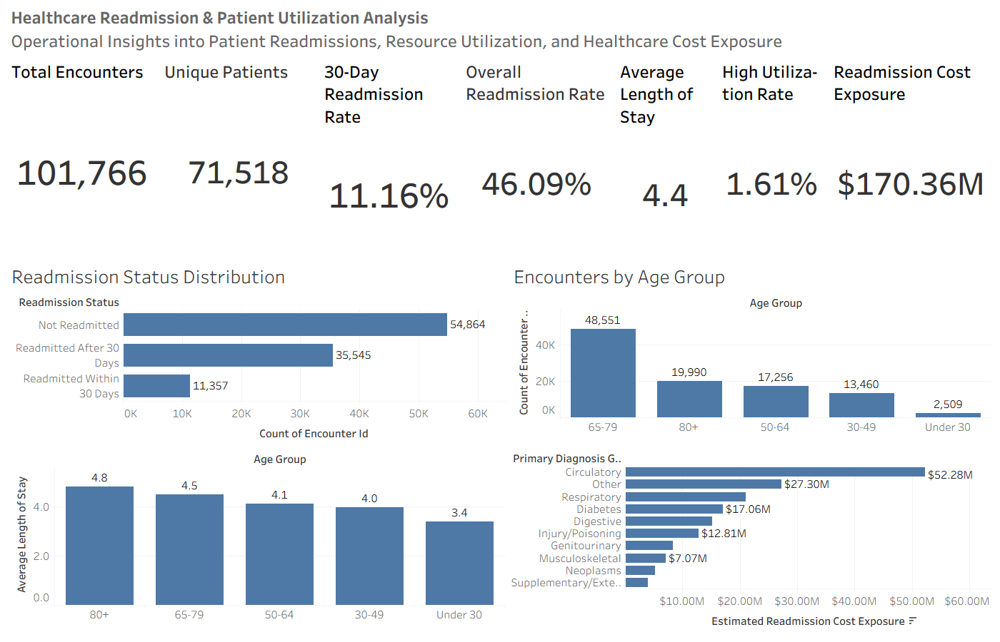
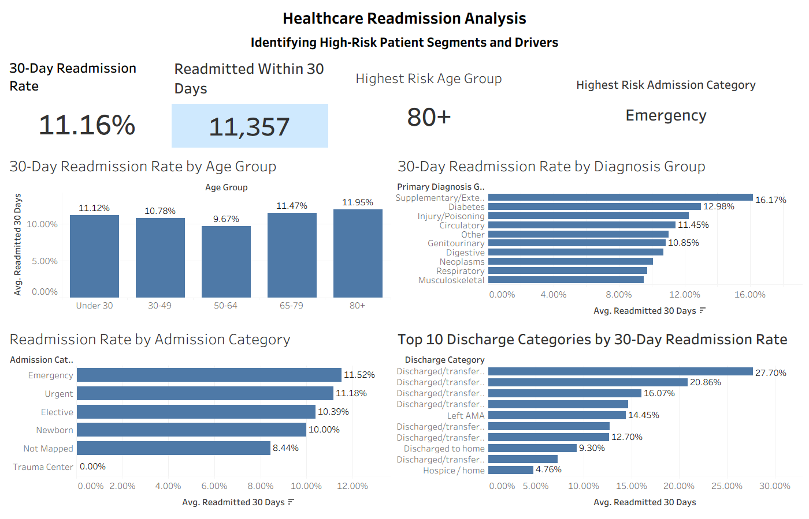
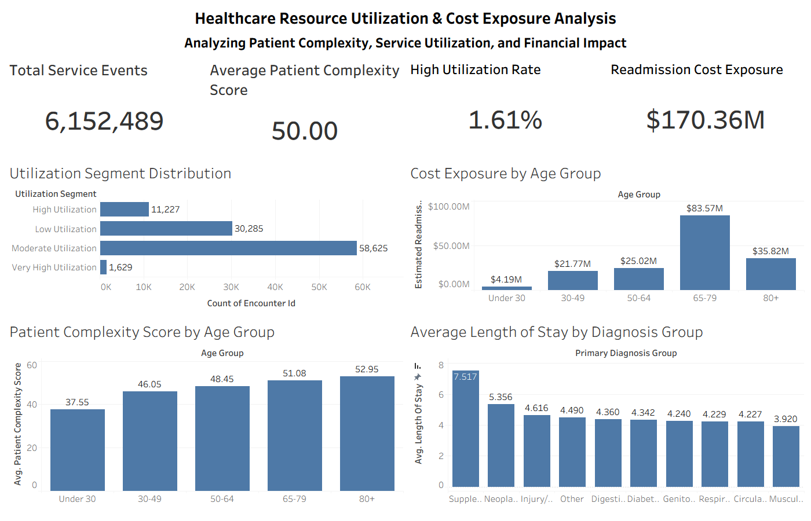

# Healthcare Readmission Risk Analysis

## Predicting 30-Day Hospital Readmissions and Analyzing Healthcare Resource Utilization

This project develops an end-to-end Healthcare Readmission Risk Analysis solution using Python, SQL, and Tableau to identify patient populations at higher risk of readmission, evaluate healthcare resource utilization, and quantify potential financial exposure associated with hospital readmissions.

---

## Business Problem

Hospital readmissions increase healthcare costs and place additional pressure on healthcare systems.

The objective of this project is to:

* Analyze 30-day hospital readmissions
* Identify high-risk patient segments
* Evaluate healthcare resource utilization
* Quantify readmission cost exposure
* Support data-driven healthcare decision-making

---

## Project Highlights

* Analyzed 101,766 patient encounters
* Evaluated 30-day readmission performance across multiple patient segments
* Identified highest-risk age groups and admission categories
* Built healthcare utilization segmentation framework
* Measured readmission cost exposure across patient populations
* Developed three executive Tableau dashboards
* Performed patient complexity and length-of-stay analysis
* Delivered business recommendations for reducing readmissions

---

## Tools & Technologies

* Python
* Pandas
* NumPy
* SQL
* Tableau
* GitHub

---

## Dataset

Healthcare Readmission Dataset

* Total Encounters: 101,766
* Unique Patients: 71,518
* Readmitted Within 30 Days: 11,357
* 30-Day Readmission Rate: 11.16%
* High Utilization Rate: 1.61%
* Estimated Readmission Cost Exposure: $170.36M

---

## Project Workflow

### Data Preparation

* Data Cleaning
* Missing Value Handling
* Feature Engineering
* Healthcare Category Mapping

### Exploratory Analysis

* Readmission Analysis by Age Group
* Readmission Analysis by Diagnosis Group
* Admission Category Analysis
* Discharge Category Analysis

### Healthcare Utilization Analysis

* Utilization Segment Distribution
* Patient Complexity Analysis
* Length of Stay Analysis
* Resource Consumption Analysis

### Financial Impact Analysis

* Cost Exposure by Age Group
* Readmission Cost Analysis
* Healthcare Resource Impact Assessment

### Business Intelligence

* Executive KPI Development
* Interactive Tableau Dashboards
* Healthcare Risk Segmentation

---

## Key Business Insights

### Readmission Drivers

* Patients aged 80+ exhibit the highest readmission risk
* Emergency admissions show the highest readmission rates
* Diabetes, circulatory, and respiratory conditions contribute significantly to readmissions
* Certain discharge dispositions experience substantially higher readmission rates

### Resource Utilization

* Moderate utilization patients represent the largest patient segment
* Patient complexity increases significantly with age
* Older patient populations incur greater healthcare costs
* Length of stay varies considerably across diagnosis groups

### Financial Impact

* Estimated readmission cost exposure exceeds $170M
* Patients aged 65-79 generate the highest cost exposure
* High-utilization patients represent a disproportionate share of healthcare resource consumption

---

## Dashboard Deliverables

### Dashboard 1 – Healthcare Readmission & Patient Utilization Analysis

Executive overview of healthcare operations including:

* Total Encounters
* Unique Patients
* Readmission Rate
* Average Length of Stay
* High Utilization Rate
* Readmission Cost Exposure



---

### Dashboard 2 – Healthcare Readmission Analysis

Analysis of readmission drivers and high-risk patient segments:

* Highest Risk Age Group
* Highest Risk Admission Category
* Readmission Rate by Age Group
* Readmission Rate by Diagnosis Group
* Admission Category Analysis
* Discharge Category Analysis



---

### Dashboard 3 – Healthcare Resource Utilization & Cost Exposure Analysis

Healthcare utilization and financial impact assessment:

* Total Service Events
* Average Patient Complexity Score
* High Utilization Rate
* Readmission Cost Exposure
* Utilization Segment Distribution
* Cost Exposure by Age Group
* Length of Stay by Diagnosis Group
* Patient Complexity by Age Group



---

## Repository Structure

```text
healthcare-readmission-risk-analysis
│
├── dashboard_1_readmission_analysis.png
├── dashboard_2_resource_utilization_cost_analysis.png
├── dashboard_3_patient_utilization_analysis.png
│
├── healthcare_readmission_risk_analysis.twb
│
├── healthcare_readmission_analysis.ipynb
├── healthcare_readmission_analysis.py
│
├── create_tables.sql
├── healthcare_business_queries.sql
│
├── diabetic_data_raw.csv
├── IDS_mapping.csv
│
├── data_dictionary.md
├── insights.md
├── summary_metrics.json
├── project_requirements.md
```

---

## Business Recommendations

### Immediate Actions

* Prioritize monitoring of elderly patients after discharge
* Strengthen follow-up programs for emergency admissions
* Increase care coordination for chronic disease patients
* Implement targeted interventions for high-risk discharge categories

### Strategic Actions

* Develop predictive monitoring systems for readmission prevention
* Optimize resource allocation for high-utilization populations
* Improve discharge planning processes
* Establish continuous healthcare performance monitoring

---

## Author

**Gopi Krishna Praveen Reddy Doranala**

MS Business Analytics

University of North Texas
